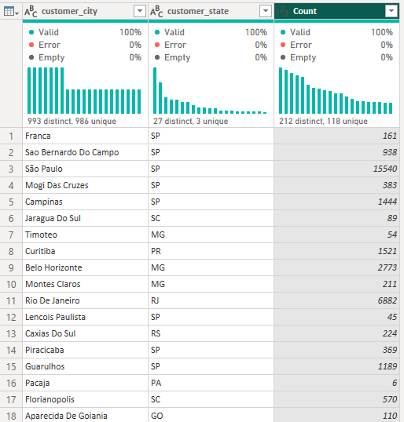
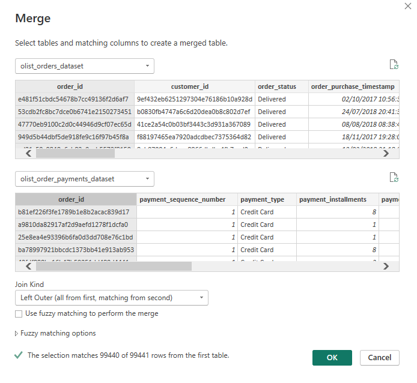

# DSA3050A_E-commerceCustomerAndSalesIntelligenceDashbooard_Group3

## Group Members
| Name | Student ID | Role |
|------|-----------|------|
| [Patricia Kiarie] | [669781] | Business Lead / Docs Coordinator |
| [Stacy Oboko] | [670722] | Power Query Specialist A |
| [Jessica Kimani] | [668701] | Power Query Specialist B |
| [Monica Njoki] | [670176] | Data Modeller / DAX Lead |
| [Paul Mbuvi] | [669984] | Dashboard Designer A |
| [Mellisa Magani] | [669782] | Dashboard Designer B / Insights Lead |

---

## 1. Business Problem

Olist is a Brazilian e-commerce marketplace that connects small and medium-sized sellers with customers across Brazil. Like most multi-seller marketplaces, Olist's leadership needs visibility into which product categories and regions drive revenue and profit, how delivery performance affects customer satisfaction, and where returns, delays, or low review scores put future sales at risk.

**Problem statement:** Olist's management currently lacks a consolidated, interactive view of sales, customer, delivery, and review performance across categories and Brazilian states — making it difficult to identify underperforming regions, prioritize high-value customer segments, or link delivery/service issues to revenue risk.

## 2. Target Organization / Industry

- **Organization:** Olist (Brazilian e-commerce marketplace)
- **Industry:** Retail / E-commerce marketplace, operating as a SaaS marketplace layer for third-party sellers
- **Our role:** Business Intelligence Consulting Team engaged to build an executive Power BI dashboard for decision-making

## 3. Dataset Source

- **Name:** Brazilian E-Commerce Public Dataset by Olist
- **URL:** https://www.kaggle.com/datasets/olistbr/brazilian-ecommerce
- **Time period covered:** 2016–2018
- **License/type:** Real, anonymized transactional data released publicly by Olist (not synthetic or fabricated)

## 4. Dataset Description

The dataset is split across 9 related CSV files (relational structure, joined by order_id / customer_id / product_id / seller_id):

| File | Approx. Rows | Description |
|------|-------------|--------------|
| olist_orders_dataset.csv | ~99,000 | Order status and timestamps (purchase, approval, delivery) |
| olist_order_items_dataset.csv | ~112,000 | Line-item level product, price, freight per order |
| olist_order_payments_dataset.csv | ~104,000 | Payment type, installments, value |
| olist_order_reviews_dataset.csv | ~99,000 | Review score and text per order |
| olist_customers_dataset.csv | ~99,000 | Customer ID, city, state, zip prefix |
| olist_sellers_dataset.csv | ~3,000 | Seller ID, city, state, zip prefix |
| olist_products_dataset.csv | ~33,000 | Product category, weight, dimensions |
| olist_geolocation_dataset.csv | ~1,000,000 | Zip prefix to lat/long mapping |
| product_category_name_translation.csv | 71 | Portuguese-to-English category names |

**Total rows (combined):** well over 50,000 (order_items alone exceeds this on its own)
**Total columns (combined across tables):** 40+ across all 9 files, well above the 15-column minimum
**Related tables:** 9, joined on shared keys — satisfies the star-schema/multi-table requirement

**Known data quality issues to clean in Power Query (Week 2):**
- Missing values in delivery timestamps and review comments
- Duplicate rows in the geolocation table (multiple lat/long entries per zip prefix)
- Near-duplicate/multilingual review text
- Product category names in Portuguese requiring a translation join
- Some orders with mismatched or orphaned foreign keys across tables
- Inconsistent data types on ID and date columns when first loaded

## 5. Key Business Questions

1. Which product categories generate the highest revenue and profit margin, and which are underperforming?
2. Which Brazilian states/regions produce the most revenue, and which are underperforming relative to their customer base?
3. How does delivery performance (on-time vs. late) vary by state and seller, and does it correlate with review scores?
4. What payment methods and installment patterns are most common, and how do they relate to order value?
5. Which customer segments (by order frequency, order value, or region) represent the highest lifetime value?
6. What trends are visible in order volume and revenue over the 2016–2018 period?
7. What risks (late delivery clusters, low-review sellers, high-return categories) should management prioritize addressing?

---

## 6. Power Query Transformations

## Raw data / loading
- Initial CSV import shows the customer table columns before transformations:
  - `customer_id`, `customer_unique_id`, `customer_zip_code_prefix`, `customer_city`, `customer_state`
- The raw import is used as the starting point for deduplication, grouping, and joins.

## Power Query — Advanced transformations
Key transformation steps performed in Power Query:
- Group By (Count distinct): summarized customers by `customer_city` and `customer_state`, producing a `Count` column of customers per city/state (this operation intentionally removes the individual `customer_id` column from the grouped result).
- Conditional columns (nested if/else-if): created an `Order tier` column based on `payment_installments` (example logic: >6 → Standard; ≥3 → Premium; else → VVIP).
- Merge queries (Left Outer): joined `olist_orders_dataset` with `olist_order_payments_dataset` on `order_id`. Result matched 99,440 of 99,441 rows with the chosen join.
- Query referencing: used `Reference` to create new queries without duplicating transformation steps.
- Parameters: `OrderStatusFilter` parameter defined (Text, required; suggested values include Delivered, Invoiced, Processing, Shipped, Unavailable) and set to `"Delivered"` for filtered reports.
- Column profiling: used column quality/distribution/statistics to inspect fields such as `deadline_month_name`.
- Custom Date table: built a Date table via Advanced Editor (M) producing Year, Month, MonthName, Quarter, Day for 2017–2019.

## Screenshots — quick view (3 selected)
Below are three representative screenshots from the `Screenshots/` folder to help understand key steps.

1) Raw data import preview (customers)

_Caption: Initial CSV import preview showing customer columns before transformation._

2) Group By result (city/state counts)

_Caption: Group By output summarizing distinct city/state combos with customer counts (example: São Paulo, SP → 15,540). This explains why `customer_id` no longer appears in the grouped output._

3) Merge queries (orders + payments)

_Caption: Merge dialog joining orders and payments on `order_id` using Left Outer join; matched 99,440 of 99,441 rows._

> Full screenshots: view the `Screenshots/` folder for all Power query images and additional steps.

## 7. Data Model Explanation

To enable scalable performance and support executive multi-dimensional analysis, the dataset was structured into a **Star Schema** centered around core transactional events. 

### Schema Overview & Cardinality

* **Fact Tables (Transaction / Event Data):**
  * `olist_order_items_dataset`: Contains line-item level transaction details (prices, freight costs, products, and sellers).
  * `olist_orders_dataset`: Contains order lifecycle events and timestamps (`order_purchase_timestamp`, `order_delivered_customer_date`, `order_estimated_delivery_date`).

* **Dimension Tables (Contextual Data):**
  * `olist_customers_dataset`: Customer demographic attributes (`customer_city`, `customer_state`).
  * `olist_products_dataset`: Product details (`product_category_name`, dimensions, weight).
  * `olist_sellers_dataset`: Seller attributes (`seller_city`, `seller_state`).
  * `olist_order_reviews_dataset`: Customer rating data (`review_score`).
  * `olist_order_payments_dataset`: Payment processing attributes (`payment_type`, `payment_installments`, `payment_value`).
  * `Dim_Date`: Dedicated DAX-generated calendar dimension for time-intelligence operations.

### Key Relationships & Filtering Directions

All relationships are configured as **1-to-Many ($1:*$)** with **Single-direction filtering** flowing from Dimension tables to Fact tables to prevent ambiguous filter contexts:

| Primary Key Table (1) | Primary Key Column | Foreign Key Table (*) | Foreign Key Column | Cardinality | Filter Direction |
| :--- | :--- | :--- | :--- | :--- | :--- |
| `Dim_Date` | `Date` | `olist_orders_dataset` | `order_purchase_timestamp` | 1:* | Single |
| `olist_customers_dataset` | `customer_id` | `olist_orders_dataset` | `customer_id` | 1:* | Single |
| `olist_orders_dataset` | `order_id` | `olist_order_items_dataset` | `order_id` | 1:* | Single |
| `olist_products_dataset` | `product_id` | `olist_order_items_dataset` | `product_id` | 1:* | Single |
| `olist_sellers_dataset` | `seller_id` | `olist_order_items_dataset` | `seller_id` | 1:* | Single |
| `olist_orders_dataset` | `order_id` | `olist_order_reviews_dataset` | `order_id` | 1:* | Single |
| `olist_orders_dataset` | `order_id` | `olist_order_payments_dataset` | `order_id` | 1:* | Single |

---

## 8. DAX Measures Created

All metrics were authored in DAX and centralized inside a dedicated `_Key Measures` table organized into functional display folders.

### 8.1 Calendar Table Script (`Dim_Date`)
Created via DAX to support Time Intelligence operations (YoY/MoM trends):

```dax
Dim_Date = 
VAR MinYear = YEAR(MIN(olist_orders_dataset[order_purchase_timestamp]))
VAR MaxYear = YEAR(MAX(olist_orders_dataset[order_purchase_timestamp]))
RETURN
ADDCOLUMNS (
    CALENDAR(DATE(MinYear, 1, 1), DATE(MaxYear, 12, 31)),
    "Year", YEAR([Date]),
    "Month Number", MONTH([Date]),
    "Month Name", FORMAT([Date], "MMM"),
    "Month Year", FORMAT([Date], "MMM YYYY"),
    "Month Year Sort", YEAR([Date]) * 100 + MONTH([Date]),
    "Quarter", "Q" & FORMAT([Date], "Q"),
    "Day of Week", FORMAT([Date], "DDD")
)
```
## 9. Dashboard Pages

The Power BI report is structured into two core pages designed to provide leadership with high-level executive metrics alongside deep-dive operational insights.

### Page 1: Executive Sales Dashboard


This page provides executive leadership with a consolidated view of macro-level sales performance, regional revenue distribution, top-performing product categories, and overall historical sales trends.

* **Key Performance Indicators (KPI Cards):**
  * **Total Orders:** `98.67K` total orders processed across the network.
  * **Total Revenue:** `R$ 13.59M` total sales generated (Sum of item price).
  * **Average Order Value (AOV):** `R$ 120.65` average spend per order item.
* **Geographic Analysis (Map – Revenue by State):** A spatial map visual displaying revenue density and order distribution across Brazilian states, highlighting sales concentration in key economic hubs (such as São Paulo and Rio de Janeiro).
* **Category Performance (Bar Chart – Revenue by Product Category):** A horizontal bar chart ranking top categories by revenue generation. Key revenue drivers include:
  1. `beleza_saude` (Health & Beauty)
  2. `relogios_presentes` (Watches & Gifts)
  3. `cama_mesa_banho` (Bed, Bath & Table)
  4. `esporte_lazer` (Sports & Leisure)
  5. `informatica_acessorios` (Computers & Accessories)
* **Temporal Growth & Interactivity:**
  * **Revenue Trend Over Time:** Line chart mapping monthly revenue trajectory from 2017 through 2019 to track seasonal peaks and multi-year trajectory.
  * **Year Slicer:** Interactive checkbox slicer filtering the entire dashboard by Year (`2017`, `2018`, `2019`).

---

### Page 2: Customer Experience & Delivery Dashboard


This page focuses on customer satisfaction, fulfillment efficiency, and analyzing the direct relationship between delivery lead times and customer review ratings across Brazilian states.

* **Customer Satisfaction & Fulfillment KPIs:**
  * **Average Review Score:** `4.09 / 5.00` rating across all reviewed customer orders.
  * **Delivery Performance Breakdown (Donut Chart):** Visualizes the proportion of orders classified by fulfillment status (**On Time**, **Late**, and **In Transit / Pending**).
* **Fulfillment Efficiency vs. Satisfaction (Scatter Plot – Delivery Time vs Review Score by State):**
  * **X-Axis:** `delivery_duration_dates` (Fulfillment time in total days).
  * **Y-Axis:** `Average of review_score` (Customer rating scale from 1 to 5).
  * **Legend/Categorization:** `customer_state` (Color-coded across all Brazilian states).
  * **Key Takeaway:** Illustrates a strong inverse relationship between delivery duration and review scores across states; as shipping lead times extend beyond 15–20 days, average review scores drop significantly toward 1–2 star levels.

## 10. Key Insights

Based on the multi-dimensional analysis conducted across the Executive Sales and Customer Experience dashboards, several core patterns emerge:

* **Geographic Revenue Concentration:** Sales are heavily skewed toward the Southeast region of Brazil, with São Paulo (`SP`) and Rio de Janeiro (`RJ`) serving as primary drivers of total order volume and overall marketplace revenue ($R\$ 13.59M$).
* **Category Performance Drivers:** Revenue is anchored by a select few high-performing product categories—most notably `beleza_saude` (Health & Beauty), `relogios_presentes` (Watches & Gifts), and `cama_mesa_banho` (Bed, Bath & Table)—while several long-tail categories generate minimal return relative to listing overhead.
* **Logistics & Satisfaction Inversion:** A strong inverse correlation exists between shipping duration (`delivery_duration_dates`) and customer satisfaction (`review_score`). Across all states, as fulfillment lead times exceed 15–20 days, average review scores drop significantly from the 4–5 star baseline down to 1–2 stars.
* **Revenue Risk Clusters:** Regional delivery delays in remote states (particularly in the North and Northeast regions) disproportionately drive down review ratings, creating potential revenue loss and high customer churn risk in expanding regional markets.

---

## 11. Recommendations

To maximize sales trajectory, optimize delivery operations, and protect customer lifetime value, Olist leadership should execute the following strategic actions:

1. **Regional Fulfillment Hub Expansion:** Establish regional distribution hubs and local fulfillment partnerships in high-latency states (North and Northeast regions) to reduce transit lead times below the critical 15-day threshold, directly improving review scores.
2. **Targeted Category Growth:** Allocate marketing spending and seller-onboarding incentives toward top-performing categories (`beleza_saude`, `relogios_presentes`, and `cama_mesa_banho`) while bundling or promoting underperforming niche categories.
3. **Seller Performance & SLA Enforcements:** Implement stricter Service Level Agreements (SLAs) for marketplace sellers regarding dispatch timelines, issuing warnings or performance penalties to low-rated sellers with consistent delivery bottlenecks.
4. **Delivery Transparency & Automated Communications:** Enhance order-tracking visibility by integrating automated proactive delivery updates, managing customer expectations during long-distance transit to mitigate negative review scores.

---

## 12. Contribution Summary

| Group Member | Student ID | Designated Role | Primary Project Contributions & Deliverables |
| :--- | :--- | :--- | :--- |
| **Patricia Kiarie** | 669781 | Business Lead / Docs Coordinator | Project scope formulation, business requirement mapping, overall README/documentation curation, and executive summary alignment. |
| **Stacy Oboko** | 670722 | Power Query Specialist A | Initial data intake, data type standardizations, missing value handling, and Portuguese-to-English translation table joins. |
| **Jessica Kimani** | 668701 | Power Query Specialist B | Relational key deduplication (geolocation, seller IDs), custom query transformations, and data hygiene optimization. |
| **Monica Njoki** | 670176 | Data Modeller / DAX Lead | Star schema data model design, relationship configuration, `Dim_Date` table creation, and DAX measure development (`Key Measures`). |
| **Paul Mbuvi** | 669984 | Dashboard Designer A | Canvas layout, color palette standardizations, and visual construction of the **Executive Sales Dashboard** (Page 1). |
| **Mellisa Magani** | 669782 | Dashboard Designer B / Insights Lead | Visual design of the **Customer Experience & Delivery Dashboard** (Page 2), visual correlation analysis, key insight synthesis, and strategic recommendations. |
